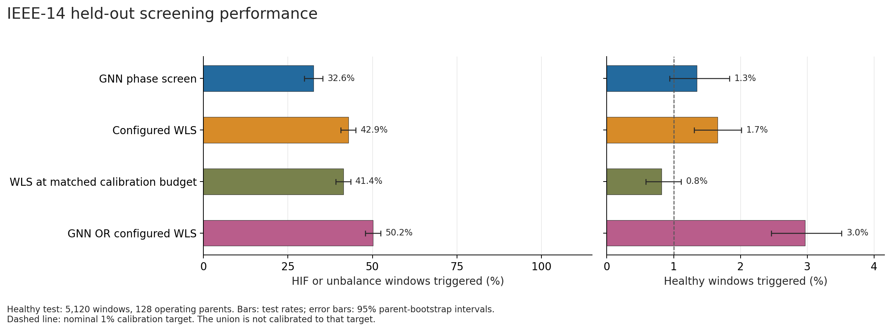
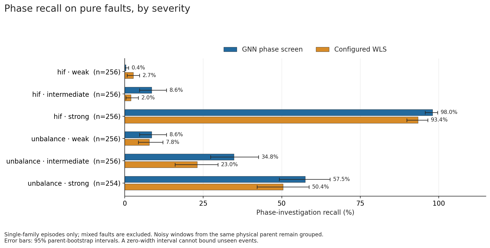
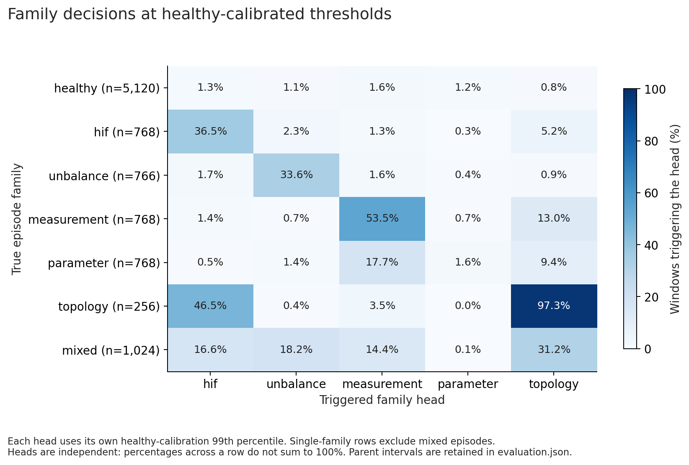
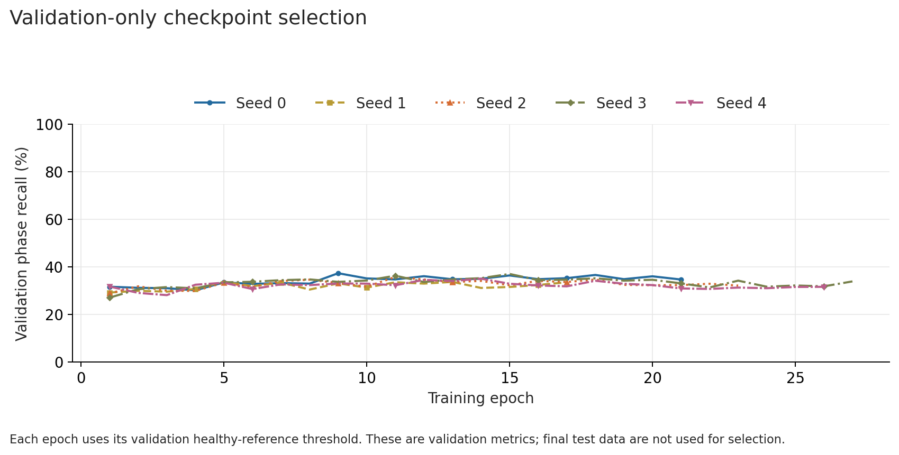

# IEEE-14 WLS-screen training and held-out test

The trained GNN provides a limited auxiliary screening benefit. It does **not**
replace WLS or establish dependable five-family diagnosis. Weak HIFs remain
almost entirely missed, and the parameter-family head is near chance.

Five random seeds were trained from scratch using the guide's three width-128
message-passing layers, batch 64, AdamW, and validation early stopping. The
primary checkpoint was selected **before test inference**: seed 0, epoch 9.
Its frozen model ID is
`c8d7462994b1eaa3d43d47bf1a7ae354eebeeeee1f4a7ae16e66fbeee9e9b8d0`.

## Independent test results

The test set has 9,470 noisy windows from 128 unseen physical operating parents:
5,120 healthy controls, 2,558 HIF/unbalance-positive windows, and 1,792
non-phase-fault windows. Mixed faults are included in the aggregate phase recall.

| Screen | Phase recall | Healthy trigger rate |
| --- | ---: | ---: |
| GNN phase head | 32.56% | 1.35% |
| Configured WLS: chi-square alpha 0.01 OR maximum normalized residual >= 4 | 42.89% | 1.66% |
| WLS with the same nominal healthy calibration budget | 41.40% | 0.82% |
| GNN OR configured WLS | 50.20% | 2.97% |

The GNN detects **187/1,461 = 12.80%** of the phase-positive windows missed by
configured WLS (95% parent-bootstrap interval: 10.60–15.32%). The union adds
7.31 percentage points of recall, with an additional 1.31 percentage points of
healthy triggers. Its trigger budget is not 1%.

Pure HIF recall increases from 32.68% with WLS to 35.68% with the GNN; the paired
gain is 3.00 percentage points (95% interval 1.30–4.69). Pure unbalance recall
increases from 27.02% to 33.55%; the paired gain is 6.53 points (3.95–9.38).
These modest average improvements hide strong severity dependence:

| Pure fault | GNN phase recall | Configured WLS recall |
| --- | ---: | ---: |
| Weak HIF | 0.39% | 2.73% |
| Intermediate HIF | 8.59% | 1.95% |
| Strong HIF | 98.05% | 93.36% |
| Weak unbalance | 8.59% | 7.81% |
| Intermediate unbalance | 34.77% | 23.05% |
| Strong unbalance | 57.48% | 50.39% |

The GNN phase head triggers on 5.02% of non-phase faults, versus 50.95% for the
configured WLS alarm. This is greater selectivity when an alarm is used to
request phase telemetry. WLS is correctly detecting many balanced errors;
these are not generic WLS false positives. No downstream acquisition cost or
LLM recovery experiment was run.

The auxiliary family-score AUROCs are HIF **0.725**, unbalance **0.757**,
measurement **0.863**, parameter **0.539**, and topology **0.991**. At each
family's healthy-reference threshold, the parameter head detects only 12/768
pure parameter cases (1.56%). Topology cases also frequently receive an HIF
hypothesis. Five emitted scores therefore must not be treated as reliable
error-type certificates.

## Training, calibration, and seed variation

| Split | Independent parents | Valid noisy windows |
| --- | ---: | ---: |
| Training | 384 | 13,818 |
| Validation | 96 | 4,416 |
| Healthy threshold calibration | 128 | 10,240 |
| Final testing | 128 | 9,470 |

Related healthy/faulty variants and their noise replicas remain in one split.
Scalers use only training graphs; checkpoint selection uses only validation.
Each frozen seed receives its own 99th-percentile healthy calibration threshold,
with strict `score > threshold`. Those empirical thresholds do not guarantee a
future 1% trigger rate. Scores are not posterior probabilities.

| Seed | Validation-selected epoch | Test phase recall | Test healthy trigger rate |
| --- | ---: | ---: | ---: |
| **0 (primary)** | **9** | **32.56%** | **1.35%** |
| 1 | 5 | 29.75% | 1.33% |
| 2 | 11 | 31.86% | 1.25% |
| 3 | 15 | 32.37% | 0.96% |
| 4 | 14 | 29.98% | 1.09% |

The primary selection was not changed using these test comparisons. All five
models use the same test parents; their evaluations are not additional
independent test samples. Intervals in [metrics.json](metrics.json) resample
whole physical parents. Degenerate intervals after zero events do not bound
unseen-event risk.

## Physical evidence and limits

All families use the same generic OpenDSS exporter and corrected shunt
convention: phase-A voltage magnitude, total three-phase powers, and net bus
injections excluding shunts already present in the configured Ybus. Parents
use constrained AC OPF with randomized spatial loads, generator costs, known
branch parameters, and legitimate connected line-outage controls. Their
post-fault simulation holds the solved generator PQ snapshot fixed.

The independent corpus audit verifies 736 distinct parent physical hashes,
no cross-split parent/seed/identical-measurement collisions, all receipt-derived
labels, common covariance, input whitelists, OPF/reference operating bounds,
and 6,079 paired corruption comparisons. Maximum healthy equation discrepancy
is 1.23e-10 pu; 608 disabled-HIF split controls differ from their unsplit
healthy snapshots by at most 1.48e-10 pu.

Four of 11,072 attempted physical variants did not converge: three related
training variants and one strong-unbalance test variant. Independent fixed-PQ
power-flow checks corroborate the convergence difficulty; this is not proof
that no mathematical solution exists. Failures remain in the ledger, not
relabeled as healthy. They remove eight planned noisy windows, including two
test windows. Every generated noisy window passed WLS preprocessing; metrics
condition on the convergent simulated corpus.

HIF means a steady-state phase-to-ground resistor in a normalized diagonal
phase-impedance realization. This is not field-data validation, arcing-HIF,
harmonic, dynamic, or IEEE-57 transfer evidence. Topology coverage is connected
branch-status error, not arbitrary variable-bus breaker topology. Parameter
perturbations are 7%, 16%, or 30%; broader parameter-error behavior is untested.
Graph-connectivity and feature ablation benefits have not been established.

## Artifacts and reproduction

Generation and training source: commit `882a89e`; branch `codex/wls-screen-gnn`.
The primary checkpoint SHA-256 is
`9ca02995b14396ee4ebb026a942532f2e75879e7d9663057d2c69bebb44875c6`.
The corpus manifest SHA-256 is
`27f1c03ff8f72cbcab4aa1a349824f96a36dc7e309fe6f094afe6c22e85c366f`.

Local run artifacts are under `output/gnn_screen/ieee14_v1_20260916/`:

- `training/checkpoint.pt` and `training/seed_*/checkpoint.pt`: frozen weights
  with scaler, schema, and training provenance.
- `evaluation/primary/calibration.json`: threshold policy bound to the primary
  checkpoint; use together with its weights.
- `evaluation/primary/evaluation.json`: every test prediction and grouped metrics.
- `performance.md`: full tables, confidence intervals, and method details.
- `corpus_audit.json`, `performance_audit.json`, `physical_failure_review.json`:
  independent verification and physical exclusions, with reproduction scripts.
- `figures/`: PNG/SVG figures and source references.
- `run_plan.json`, `runtime_environment.json`, and logs: fixed experiment settings
  and execution evidence. Training used a local RTX 4080; 114 total epochs across
  five early-stopped seeds took approximately 490 seconds, excluding graph preparation.

Post-run verification: **332 tests and 111 subtests passed**. Independent
recomputation verified all 124 saved rates and all 124 parent-bootstrap
intervals. A [saved-checkpoint handoff check](deployment_smoke.json) reconstructed
four exact noisy test windows and matched CPU inference to saved GPU scores
within 8.94e-8, with identical phase/anomaly trigger decisions.

The full corpus/cache/checkpoints stay in the local output directory. This
versioned folder preserves compact [metrics](metrics.json), [seed results](seed_summary.json),
[corpus audit](corpus_audit.json), [performance audit](performance_audit.json),
and figures. Use the generator, dataset, train, calibrate, and evaluate CLIs in
the parent README to reproduce; generation seed is 20260917.

Keep the independent acquisition and physical verification routes. This pilot
does not justify replacing them with a negative learned screen.
