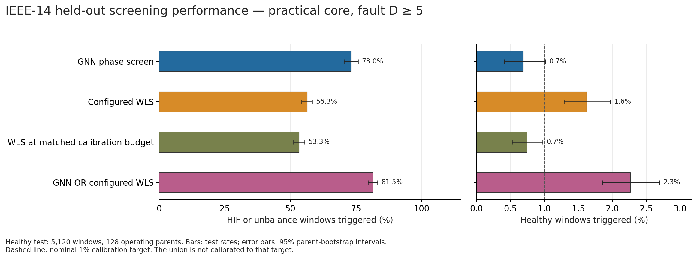
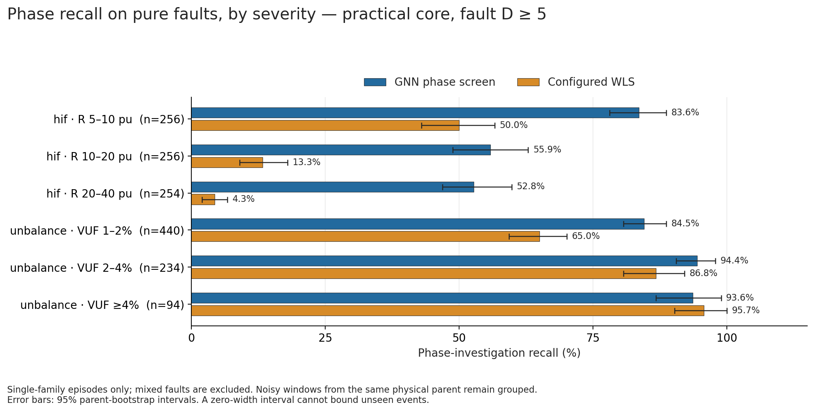
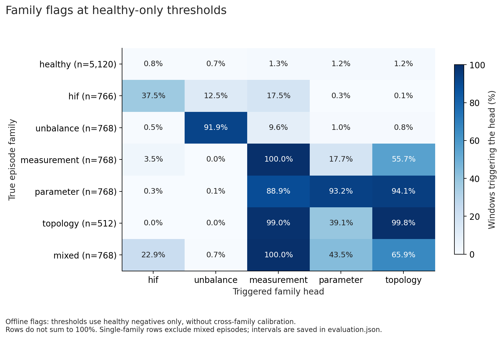
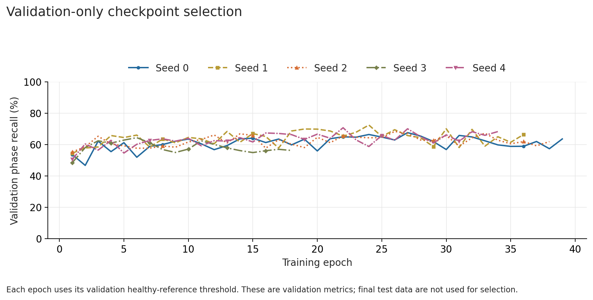

# Practical SFT-supported scenarios: V2 results

The revised scenario design provides substantially more useful phase-screening
supervision than the original near-noise pilot. On the **same selected practical
test population**, retraining raises phase recall from 60.78% for frozen V1 to
73.02% for V2. This does not establish coverage of all physical faults or solve
the separate problem of turning family scores into reliable multi-label decisions.

The selection rules were set on independent development simulations before
generating the new splits or inspecting any V2 test scores. See the
[scenario decision and SFT comparison](../../../../docs/gnn_practical_scenarios_20260916.md).

## Chosen practical profile

| Family | Main proposal |
| --- | --- |
| Measurement | Every bias 10–15 sigma; single meter and 2–5 meters of the same channel type |
| Parameter | True physical R, X, or RX factors 0.1–0.5 or 2–5 on active nonzero-R/X lines; reported parent model remains fixed |
| Unbalance | Dirichlet(3, 3, 3) phase-load fractions; preserve total P/Q; actual maximum sequence VUF >= 1% |
| HIF | Explicit stronger log-uniform resistance bands 5–10, 10–20, 20–40 pu; ABC and location 0.25–0.75; differential-current significance >= 6 sigma |
| Topology | Connected physical branch-status changes with the reported model fixed; narrower than full node/breaker SFT |
| Mixed | Measurement+parameter, measurement+topology, measurement+HIF; the physical component must qualify independently before the meter overlay |

Every main positive also satisfies offline paired clean separation
`D=norm((z_fault-z_parent)/sigma)>= 5`. Sensor noise remains 0.001 pu voltage and
0.01 pu power. Selection never uses a noisy WLS alarm, a learned score, or teacher
success. The known-parent D is neither an online feature nor a guarantee of
identifiability across unknown operating conditions and competing causes.

SFT-range HIF resistance 20–200 pu is retained separately. The main 5–20 pu extension
is deliberately stronger; it is not described as the original SFT distribution.
Many low-balanced-signal HIFs can remain physically important. A separate
boundary/challenge manifest preserves their physical-positive labels.

## Data and coverage

| Split | Physical parents | Main noisy windows |
| --- | ---: | ---: |
| Training | 384 | 13,820 |
| Validation | 96 | 4,416 |
| Healthy calibration | 128 | 10,240 |
| Final test | 128 | 9,470 |

The boundary manifest contains 3,826 noisy windows, including 822 from test
parents. Of those test windows, 256 are the explicitly SFT-matched HIF challenge.
Boundary windows share parents with the main split, so they are not additional
independent operating-parent coverage.

Generation recorded 15,966 proposals: 10,333 main positives accepted, 608 SFT-HIF
challenge means retained, 5,001 valid positives below main criteria, and 24
physical failures. Three HIF 20–40 slots exhausted their attempt budget (two
training, one test). Counts of rejection reasons overlap; they are not an
additive partition of rejected cases.

Selection has a substantial phase effect. For pure HIFs, main acceptance was
78.32% for phase A, 26.23% for B, and 26.46% for C; the retained main population was
59.53% A, 19.60% B, 20.87% C. This follows the permitted phase-A magnitude input.
The resulting HIF metrics are not equal-phase or unrestricted HIF coverage.

The independent corpus audit verified fixed reported models, actual physical
parameter/status changes, common covariance and exporter, component-valid
mixtures, parent/shard/old-V1 disjointness, and every retained core rule. It passed
under the pre-existing physical numerical tolerances, with two recorded
post-OPF reference-PF Q drifts no larger than 0.000146 MVAr, below the existing
0.01 MVAr tolerance. No data were rounded or repaired to pass the audit.

## Frozen model comparison

Architecture, loss weights, optimizer, and five-seed training configuration are
unchanged from V1. Validation selected **seed 1, epoch 24** before test inference.
Each model uses its own healthy-only calibration threshold at the same nominal
1% target. Frozen V1 retains its original weights and scaler and receives only
new healthy calibration on the new population.

| Screen on practical main test | Phase recall | Healthy triggers |
| --- | ---: | ---: |
| V2 GNN | **73.02%** | **0.68%** |
| Frozen V1, recalibrated | 60.78% | 0.76% |
| Configured WLS (alpha 0.01 OR maximum normalized residual >= 4) | 56.31% | 1.62% |
| WLS at matched healthy-calibration budget | 53.30% | 0.74% |
| V2 GNN OR configured WLS | 81.45% | 2.27% |

The paired V2–V1 recall gain is **12.23 percentage points**, with 95%
physical-parent bootstrap interval **[9.99, 14.53]**. V2's phase recall interval is
[70.45%, 75.81%]; its healthy-trigger interval is [0.41%, 1.02%]. The union is not
calibrated to 1%.

| Pure fault | V2 phase recall | Frozen V1 phase recall | Configured WLS recall |
| --- | ---: | ---: | ---: |
| HIF | 64.10% | 44.13% | 22.58% |
| Unbalance | 88.67% | 88.15% | 75.39% |

The HIF retraining gain is 19.97 points (95% interval 16.53–23.37). Unbalance's
0.52-point retraining difference is inconclusive (interval −2.08–2.99); its much
higher score than the old unfiltered experiment mostly reflects the changed
test population. Overall, V2 adds 450/782 = 57.54% of the phase-positive windows
missed by configured WLS.

| Seed | Validation-selected epoch | Main test phase recall | Healthy triggers |
| --- | ---: | ---: | ---: |
| 0 | 27 | 69.55% | 0.66% |
| **1, primary** | **24** | **73.02%** | **0.68%** |
| 2 | 26 | 67.43% | 0.66% |
| 3 | 6 | 65.20% | 0.72% |
| 4 | 22 | 70.45% | 0.62% |

No model was reselected using test scores. The 165 total training epochs took
approximately 732 seconds on the local RTX 4080, excluding graph preparation.

## Family representation and decision-policy limits

Family score AUROCs on the main test are HIF 0.949, unbalance 0.990,
measurement 0.995, parameter 0.975, and topology 0.990. Parameter score separation
is substantially better than the original pilot, but this is a different,
stronger population and a retrained model.

**Healthy-only family thresholds are not adequate classification thresholds
against competing fault families.** They were retained unchanged for this
evaluation and were not retuned using the test set. They can emit many extra
labels even when the correct family has the highest score:

| Pure family | Correct family head exceeds its threshold | Exactly correct family flags, no extras | Descriptive top-1 family ranking |
| --- | ---: | ---: | ---: |
| Measurement | 100.00% | 38.80% | 98.18% |
| Parameter | 93.23% | 0.26% | 87.24% |
| Topology | 99.80% | 0.00% | 76.76% |

Top-1 ranking across all 3,582 pure single-fault test windows is 89.61%; HIF is
97.78% and unbalance 83.85%. This explicitly assumes one fault is already known
to exist and excludes healthy/mixed episodes. It is not operational overall
classification accuracy. The online adapter returns family scores as hypotheses;
these hard flags are an offline evaluation policy, not correction certificates.

The general-anomaly head also did not uniformly improve:

| Pure balanced family | V2 any-anomaly recall | V1 any-anomaly recall | Configured WLS recall |
| --- | ---: | ---: | ---: |
| Measurement | 82.42% | 95.96% | 100.00% |
| Parameter | 69.66% | 80.99% | 90.10% |
| Topology | 93.75% | 98.05% | 98.63% |

The checkpoint was selected for phase-screening recall. Neither its auxiliary
anomaly output nor its family thresholds should replace balanced-WLS detection
and physical diagnosis. A future family-decision policy needs validation against
other fault families, not only healthy negatives, and fresh confirmation data.

## Boundary coverage remains limited

The aggregate boundary phase recall is 15.13%, combining retained below-core
HIF/unbalance cases and the separately retained SFT-range HIF challenge. The
**SFT-range HIF 20–200 pu subset alone is 15/256 = 5.86%**
(95% interval 2.73–9.38), versus 3/256 = 1.17% for WLS. Within that challenge,
244 windows have D < 5, with 7 detected; only 12 have D >= 5, with 8 detected. The latter
has just six parents and a wide interval, so it does not establish broad coverage.

These failures remain positive-label challenge results. Stronger training does
not create missing information in the balanced snapshot. Independent acquisition
and the richer SFT diagnostic route remain necessary for these events.

## Artifacts and reproducibility

Generation/training source: commit `1c1e4fa`, branch `codex/wls-screen-gnn`.
Root generation seed is 2026091933, expanded deterministically into four
independent shard seeds. Main and boundary receipts preserve all proposals,
physical failures, paths, parent IDs, and source hashes.

Primary checkpoint SHA-256:
`2aaa28cb85cd62059cdb4565032504345ce777b4dfea8bb891845dc38a35cbf0`.
Primary model ID:
`65e41aa2ebde326712e6686fe4f590936fae8b70ecfcb88dffb8c85f30ae35cb`.

Full local artifacts: `output/gnn_practical_v2_20260916/`.

- `training/checkpoint.pt`, paired with `evaluation/primary/calibration.json`.
- `evaluation/primary/evaluation.json` and `boundary_evaluation.json`: all
  predictions and intervals.
- `evaluation/previous_v1_recalibrated/`: paired frozen-V1 comparison.
- `corpus/manifest.jsonl`, `boundary_manifest.jsonl`, `proposal_ledger.jsonl`,
  `physical_failures.jsonl`, and per-shard source receipts.
- `corpus_audit.json`, preserved strict diagnostics, and `performance_audit.json`
  with their reproduction scripts. The performance audit independently
  recomputed 1,168 saved rates and 1,168 parent-bootstrap intervals.
- `performance.md`, `run_plan.json`, figures, checkpoints, and logs.

This versioned folder retains compact [main metrics](metrics.json),
[boundary metrics](boundary_metrics.json), [seed results](seed_summary.json),
[corpus audit](corpus_audit.json), and [performance audit](performance_audit.json).

Final regression validation: **385 tests and 111 subtests passed** across the
GNN, numerical foundations, provider WLS, acquisition routing, and protocol
integration suites. The [deployment smoke check](deployment_smoke.json) rebuilt
six saved noisy cases and compared CPU adapter inference with the GPU evaluation:
maximum score difference was 2.54e-7, with identical phase, anomaly, and family
threshold decisions. These are execution checks, separate from the held-out
population estimates above.

